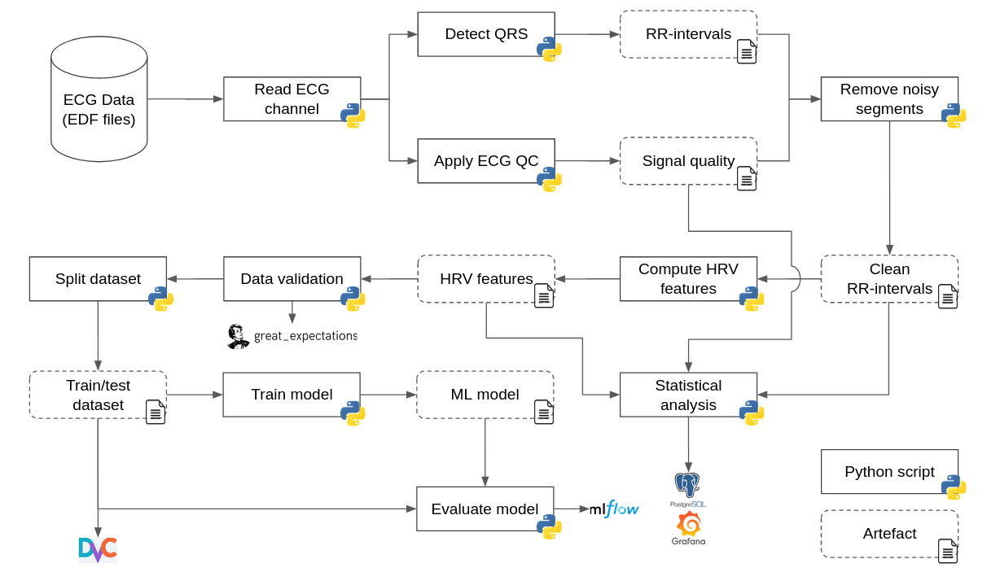
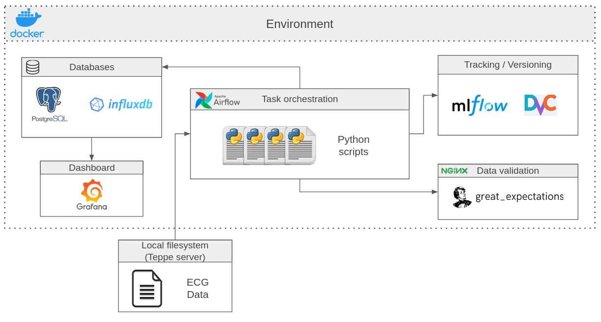

# Seizure Detection pipeline

This project aims to use machine learning algorithms to detect seizure from ECG data, in a MLOps environment.
Here is an overview of the automated ML pipeline :



This pipeline runs inside a dockerised environment, represented below :



## Prerequisites

### Dependencies

The pipeline requires these packages to run :
* Python >= 3.7
* pandas == 1.1.5
* numpy == 1.19.5
* pyEDFlib == 0.1.22
* click == 8.0.1
* py-ecg-detectors == 1.0.2
* wfdb == 3.4.0
* biosppy == 0.7.3
* hrv-analysis == 1.0.4
* ecg-qc== ???
* great-expectations == 0.13.25
* airflow-provider-great-expectations == 0.0.7
* psycopg2-binary == 2.8.6

You can install them in a virtual environment on your machine via the command : 
```sh
    $ pip install -r requirements.txt
```

### Environment
You need to have [docker](https://docs.docker.com/get-docker/) and [docker-compose](https://docs.docker.com/compose/install/) installed on your machine to set the environment up.

## Getting started

### Setting up environment and launch docker-compose
After cloning this repository, you can run these commands :

```sh
    $ source setup_env.sh
    $ docker-compose build
    $ docker-compose up airflow-init
    $ docker-compose up -d
```
**Warning**: Here are the default ports used by the different services. If one of them is already in use on your machine, change the value of the corresponding environment variables in the *env.sh* file before running the commands above.
| Service   | Default port |
|:---------:|:------------:|
|Postgresql|5432|
|InfluxDB|8086|
|Airflow|8080|
|Grafana|3000|
|MLFlow|5000|
|Great expectations (via NGINX)|8082|
|Flower|5555|
|Redis|6379|


### UI
Once the services are up, you can interact with their UI :
* **Airflow** : [http://localhost:8080](http://localhost:8080)
* **Grafana** : [http://localhost:3000](http://localhost:3000)
* **MLFlow** : [http://localhost:5000](http://localhost:5000)
* **Great expectations** : [http://localhost:8082](http://localhost:8082)
* **Flower** : [http://localhost:5555](http://localhost:5555)

When required, usernames and passwords are *admin*. 

### Executing script separately
First export the python path to access the scripts :
```sh
    $ export PYTHONPATH=$(pwd)
```
You can now execute each Python script separately by running :
```sh
    $ python3 <path-to-Python-script> [OPTIONS]
```
The required options are shown by running the `--help` option.

### Setting down the environment
You can stop all services by running : 
```sh
    $ docker-compose down 
```
If you add the `-v` option, all services' persistent data will be erased.

## License
This project is licensed under the **GNU GENERAL PUBLIC License**.
